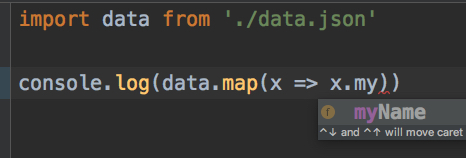
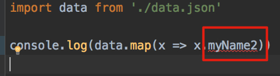

TypeScript Import Json File Demo
================================

With typescript 2.9+ `resolveJsonModule` support, typescript can discovery the types of json file,
and webstorm can also have type checking.

Webstorm can give tips about the field names:



If typed wrong field names, webstorm reports error:



Typescript compiler will also give similar error:

```
$ npx ts-node hello.ts
⨯ Unable to compile TypeScript:
hello.ts(3,29): error TS2551: Property 'myName2' does not exist on type '{ "myName": string; }'. Did you mean 'myName'?
```

Run
---

```
npm install
npx ts-node hello.ts
```

It will print `[ 'typescript', 'json' ]`

Notice
------

`tsconfig.json` has all necessary options for this demo working.